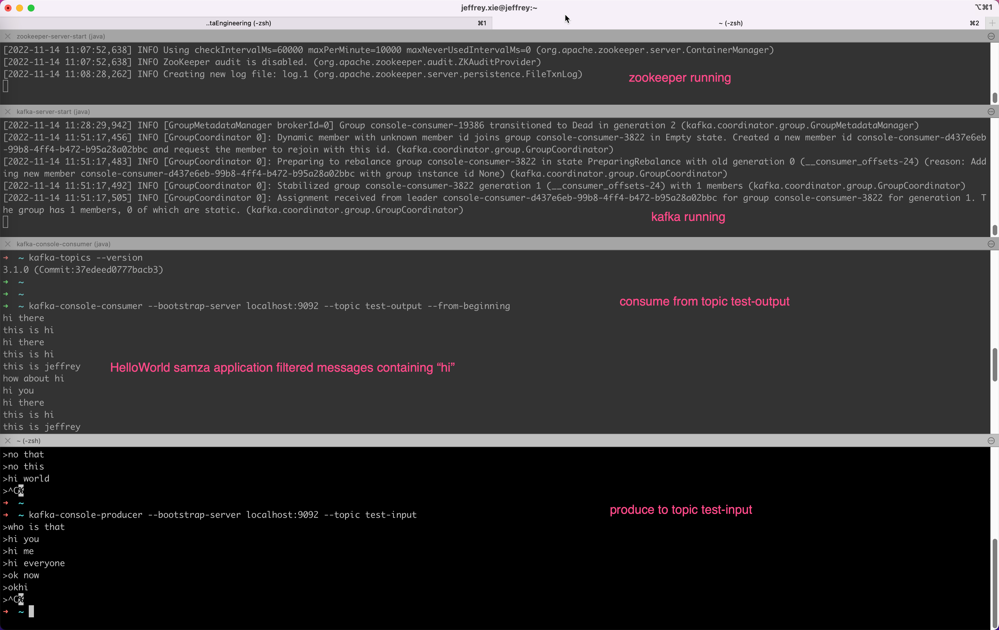
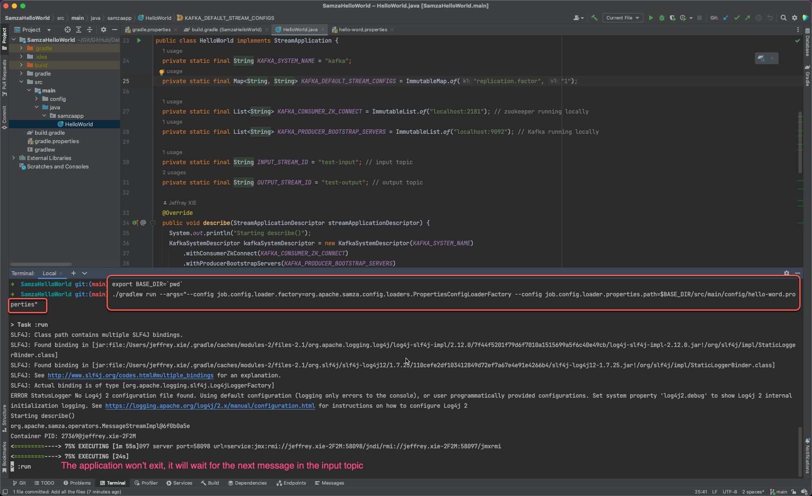

# Samza hello world
<hr>

## Prerequisite

Follow [Apache Kafka Installation on Mac using Homebrew](https://medium.com/@Ankitthakur/apache-kafka-installation-on-mac-using-homebrew-a367cdefd273) to:
- Install Kafka
- Start zookeeper
- Start Kafka
- Create topic `test-input`

## Run this samza application
After cloning this Git repo, cd to this SamzaHelloWorld folder, then run:
```
export BASE_DIR=`pwd`
./gradlew run --args="--config job.config.loader.factory=org.apache.samza.config.loaders.PropertiesConfigLoaderFactory --config job.config.loader.properties.path=$BASE_DIR/src/main/config/hello-word.properties"
```

Then you can run below command to produce some messages to topic `test-input`:
```
kafka-console-producer --bootstrap-server localhost:9092 --topic test-input
```

The samza application will filter messages containing "hi" and write them to output topic `test-output`, which you can verify
by below command:
```
kafka-console-consumer --bootstrap-server localhost:9092 --topic test-output --from-beginning
```

For more details, please refer to below screenshots:
The terminal


The IDE



