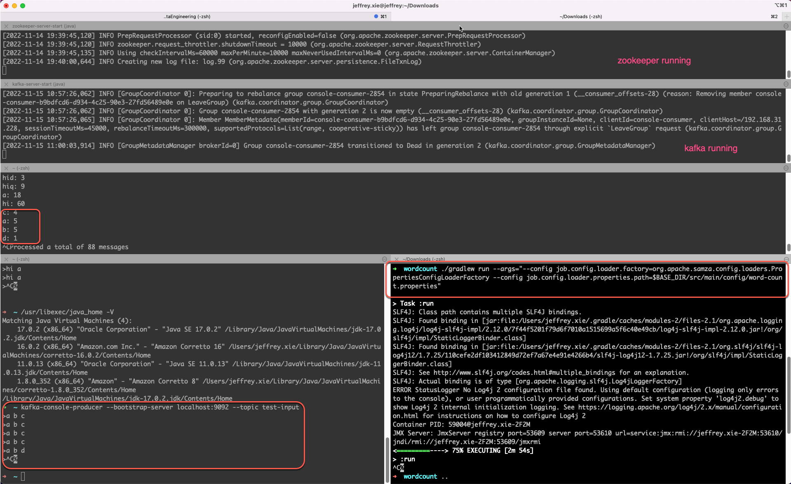

# Samza Word Count
Follow https://samza.apache.org/startup/quick-start/1.6.0/samza.html and fix problems to make it work with JDK 8.
<hr>

## Prerequisite

Follow [Apache Kafka Installation on Mac using Homebrew](https://medium.com/@Ankitthakur/apache-kafka-installation-on-mac-using-homebrew-a367cdefd273) to:
- Install Kafka
- Start zookeeper
- Start Kafka
- Create topic `test-input`

This Application is tested with:
- JDK 8
- Kafka 3.1.0

## Run this samza application
After cloning this Git repo, cd to this SamzaWorldCount folder, then run:
```
export BASE_DIR=`pwd`
./gradlew run --args="--config job.config.loader.factory=org.apache.samza.config.loaders.PropertiesConfigLoaderFactory --config job.config.loader.properties.path=$BASE_DIR/src/main/config/word-count.properties"
```

Then you can run below command to produce some messages to topic `test-input`:
```
kafka-console-producer --bootstrap-server localhost:9092 --topic test-input
```

The samza application will count the word frequencies every 5 seconds and write them to output topic `word-count-output`, which you can verify
by below command:
```
kafka-console-consumer --bootstrap-server localhost:9092 --topic word-count-output --from-beginning
```

For more details, please refer to below screenshots:
The terminal



